# 概览
为了尽可能避免重复的工作，将部分繁琐的操作命令集成进 makefile 中。通过将 golangci-lint 集成进 makefile 中进行静态代码检查，尽最大可能确保代码质量。


# 功能需求
- [x] 一键编译（`make`）
- [x] 能够自动检查、安装 makefile 中缺失的工具
- [ ] 拥有一定程度的 CI/CD 能力，减少手动维护的重复工作
  - [ ] Docker 相关
  - [ ] golangci-lint 集成进 github action 中
- [x] 具有良好的提示信息输出
- [x] 可灵活配置（可以在 develop 阶段关闭部分检查）
- [x] 易拓展


# quick start
```bash
# make help

Usage: make <TARGETS> <OPTIONS> ...

Targets:
  build      Build and compile source code to program.
  run        Build and compile source code, and then run the program.
  clean      Remove all files that are created by building.
  checkout   Remove and clean unnecessary files before committing files.
  help       Show this help information.

Options:
  DEBUG        Whether to generate debug symbols. Default is 0.
               (example: make build DEBUG=1; make run DEBUG=1)
  RACE         Whether to enable data race detection. Default is 0.
               (example: make build RACE=1; make run RACE=1)
  LINT         Whether to enable golangci-lint. Default is 1.
               When golangci-lint disable, 'go vet' will be enabled.
               (example: make build LINT=0; make run LINT=0)
```

example:
```bash
# 一键编译
make

# 开发常用命令
make build       # 将源码编译为可执行文件
make run LINT=0  # 将源码编译为可执行文件，并运行（关闭 golangci-lint 检查）
make run RACE=1  # 将源码编译为可执行文件，并运行（关闭 golangci-lint 检查，开启并发检查）
make build RACE=1 DEBUG=1 # 将源码编译为可执行文件，（开启并发检查，添加 dlv 调试信息）
make go.lint     # 单独执行 golangci-lint 检查

# 清理文件
make clean       # 清除编译相关的文件
make checkout    # 代码提交前的清理、静态检查
```


# 设计细节
## 文件分布
```bash
# tree ./
./
├── go.mod
├── LICENSE
├── main.go
├── Makefile          # 顶层 makefile，对 script/make-rule/ 下的 .mk 进行封装
└── script
    └── make-rule     # 最小 make 指令执行单元
        ├── common.mk # 通用变量处理
        ├── golang.mk # Go 相关
        └── tool.mk   # 相关工具的检查与自动安装

2 directories, 7 files 
```

## 分层设计

整个 makefile 体系只分为两层：

- 第一层是位于 `Makefile` 的命令，放的是最常用自动化功能，是第二层子命令的集合与封装。如：每次提交代码推荐运行的 `make checkout`。`make checkout` 实际上是 `make clean`、`make go.fmt`、`make go.lint` 以及 `git status` 命令的集合。这一层通常是调用其他子命令的。
- 第二层则是位于 `script/make-rule/` 目录下的子命令，每个命令都是完成某一个具体工作的最小执行单元（功能、职责尽可能单一）。这一层的子命令可以调用其他子命令，但是不可以直接调用第一层的命令。如：`make go.build`, 首先完成 `go.lint` 中的检查，然后执行 `go build xxx.go` 完成实际编译。

在这种分层体系下，当使用者想要清除所有编译产生的文件，可以直接执行 `make clean`；但是当使用者只想清理 Go 相关的文件时，只需要执行 `make go.clean` 即可。这样命令执行的颗粒度、灵活性相对可控。

目前整个 makefile 体系不打算引入更多的分层，一是更多的分层将会引入更多不必要的 makefile 语法来完成分层解耦，不利于整个 makefile 的阅读与维护；二是当整个项目需要三层的 makefile 来支撑的话，那其实有些代码可能是可以进一步抽象，作为一个独立的 package 分离出去的。

另外，通过下面的文本分析方式，针对每一行以 `## ` 开头的注释，自动生成 `make help` 中的帮助信息，可以减少开发时的工作负担。
```makefile
## build: Build and compile source code to program.
.PHONY: build
build:
	@echo -e "\033[1;36m====== make build ======\033[0m"
	@$(MAKE) go.build

## help: Show this help information.
.PHONY: help
help: Makefile
	@echo -e "\nUsage: make <TARGETS> <OPTIONS> ...\n\nTargets:"
	@sed -n 's/^##//p' $< | column -t -s ':' | sed -e 's/^/ /'
```


## 可灵活配置
灵活配置这一点是通过在输入 make 的时候，同时设置相应的 OPTIONS 实现的。因为 OPTIONS 并不是对所有命令都产生作用的，所以相关的 OPTIONS 处理代码，放在起作用的文件中，方便管理。

以 DEBUG 这个 OPTIONS 为例（`make build DEBUG=1`）：使能之后，在 go 编译器中加入相应的 flag，为二进制文件加入 dlv 的调试信息

```makefile
GO_BUILD_FLAGS := -v

# debug flag for dlv
ifeq ($(origin DEBUG),command line)
	GO_BUILD_FLAGS += -gcflags="all=-N -l"
endif

.PHONY: go.build
go.build: go.lint
	@echo -e "\033[1;36m-->[CMD:go.build, go-flag:$(GO_BUILD_FLAGS), bins:$(BINARY_NAME), root-dir:$(ROOT_DIR)]\033[0m"
	$(GO) build $(GO_BUILD_FLAGS) -o $(BINARY_NAME) .
```


## Go 相关

### golangci-lint 代码静态检查
> https://golangci-lint.run/

golangci-lint 的配置文件为 `.golangci.yaml`，这里只是简单的调用了这个工具而已。
另外，为了开发阶段的验证方便，可以通过 `LINT=0` 的方式，暂时关闭 golangci-lint 这个较为严格的静态检查，改用 `go vet` 这个官方的检查工具。

引入代码的静态分析，可以帮着我们提前发现代码中的潜在 bug，提高代码交付质量。在代码提交前、进行集成测试前，都推荐使用 golandci-lint 对代码进行检查。

后期可以将 golangci-lint 集成进 github action 中，进行强制检查。


## 工具自动检查与安装

以 golangci-lint 为例，调用关系如上图。

1. 执行 `go.lint` 之前先要检查 golangci-lint 是否安装
```makefile
.PHONY: go.lint
go.lint: tools.verify.golangci-lint
	......
```

2. 被 `%` 通配符捕获，进行统一的检查
```makefile
# other makefile calls this PHONY to verify tool
# check, dispatch and install related tool
tools.verify.%:
	@if ! which $* &>/dev/null; \
	then \
		@echo -e "\033[1;31m-->[Missing $* tool, try to install]\033[0m" \
		$(MAKE) install.$*; \
	fi
```

3. 利用 `$*`, 将安装请求分发到 `install.golangci-lint` 中
```makefile
# Because golangci-lint release too fast to adapt the code, only use the specific version(now is v1.41.1).
# More install detail in: https://golangci-lint.run/usage/install/#local-installation
# Note: such go install/go get installation aren't guaranteed to work. We recommend using binary installation.
# binary will be $(go env GOPATH)/bin/golangci-lint
.PHONY: install.golangci-lint
install.golangci-lint:
	@echo -e "\033[1;36m-->[install-tool:golangci-lint, to:$(go env GOPATH)/bin/golangci-lint]\033[0m"
	@echo -e "\033[1;36m--> This step may take a long time, please be patient and wait."
	curl -sSfL https://raw.githubusercontent.com/golangci/golangci-lint/master/install.sh | sh -s -- -b $(go env GOPATH)/bin v1.41.1
```


